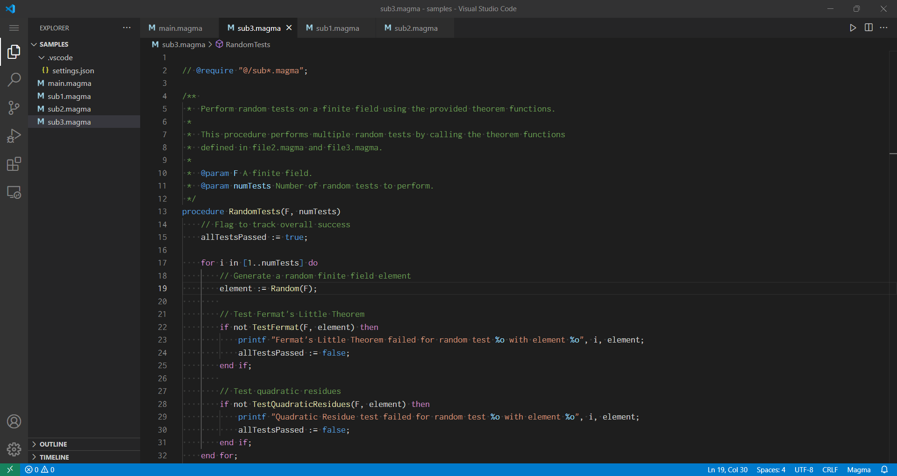
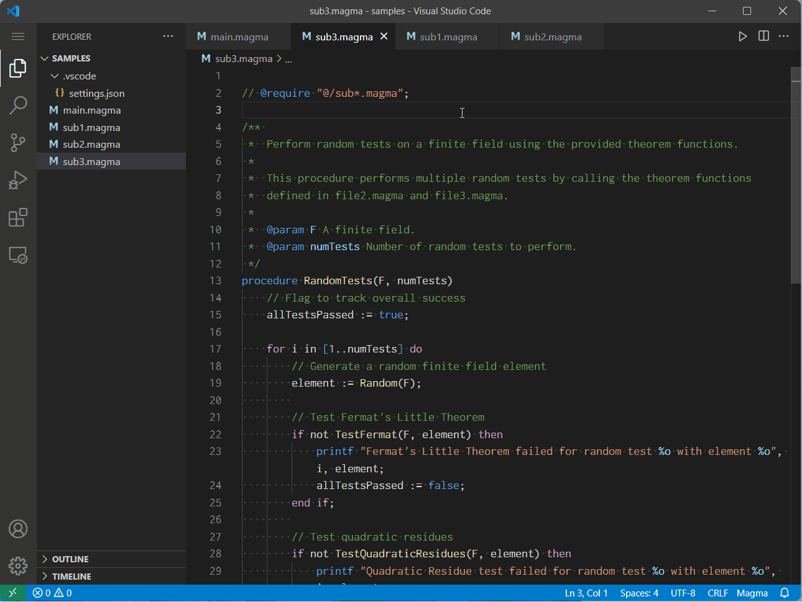
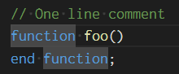
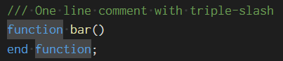
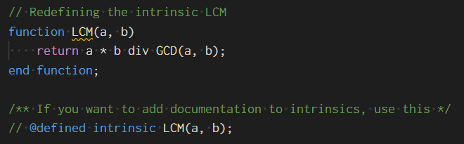
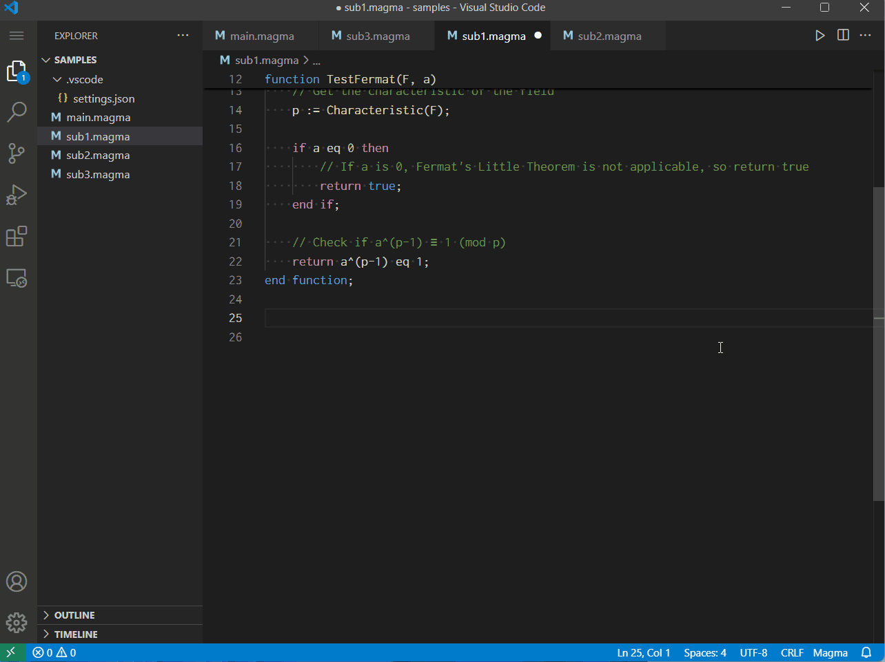
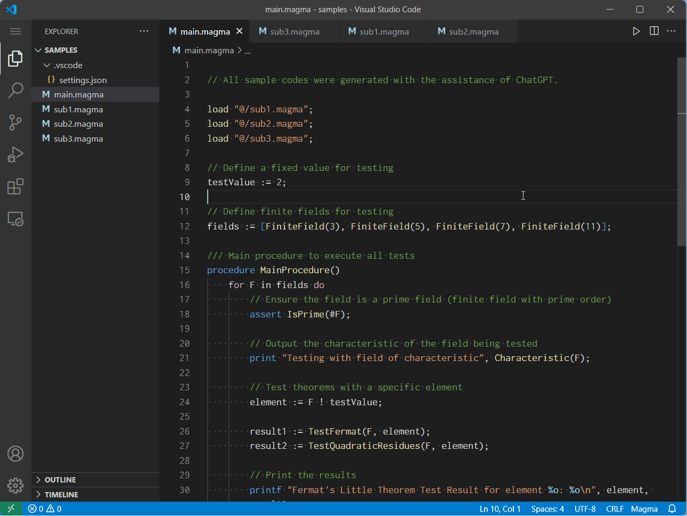
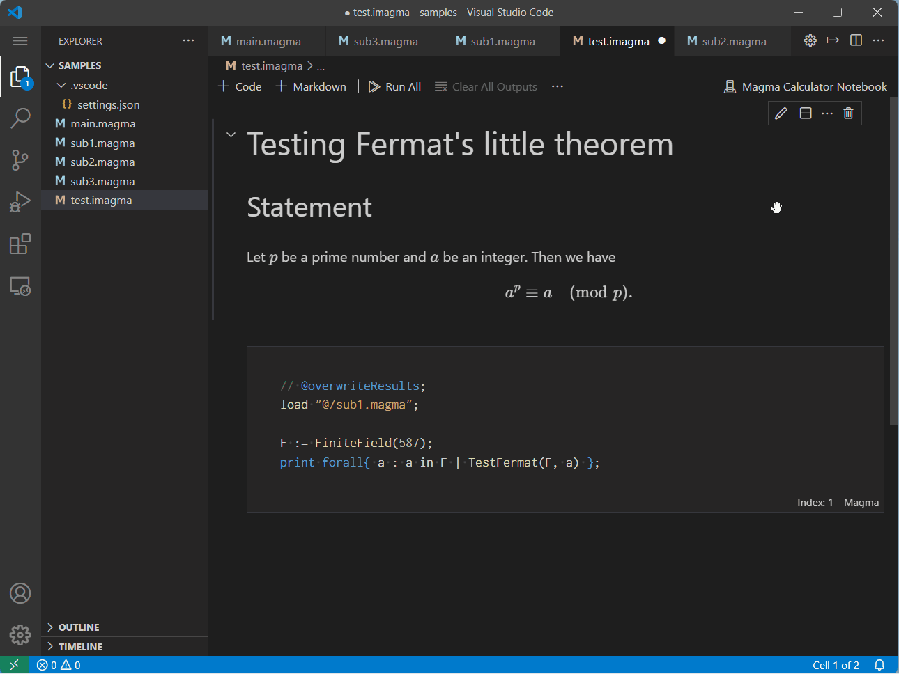

# MAGMA Language Support & IntelliSense

This extension adds language support and IntelliSense for [Magma computational algebra system](http://magma.maths.usyd.edu.au/magma/) to Visual Studio Code.

See also the sample code in its [repository](https://github.com/usuke1726/MagmaLanguageSupport).

## Features

### Syntax highlighting



### Definition



- Partial JSDoc support:
    - Function references provide hover widgets with documentation of their definitions.
    - Supports `@param`, `@returns`, `@example`.
- Go to Definition:
    - Load statements must be in the format `load "@/{path}";` or `load "@{alias}/{path}"`.
        - You cannot use `load "./{path}"` when hovering documentation or jumping to definitions.
        - `@/` of the path is treated as `./`.
        - `@{alias}/` of the path is treated as the path configured by `settings.json`.
    - The comment `// @defined intrinsics functionName();` configures a definition. (It does not actually define the function).
    - The comment `// @require "@/{path}";` configures a dependency. (It does not actually load the file).
        - You can use glob patterns in `@require` statements.

#### Settings

The following configurations are available:

`enableDefinition`

This specifies whether features with definitions are enabled or disabled, or whether they are enabled only if they have documentation.

```jsonc
    "MagmaLanguageSupport.enableDefinition": {
        "forwards": false,
        "functions": true,
        "variables": "onlyWithDocumentation"
    }
    // or
    "MagmaLanguageSupport.enableDefinition": true,
    "MagmaLanguageSupport.enableDefinition": "onlyWithDocumentation",
```

Default is `true`.

`enableHover`

This specifies whether documentation hovers are enabled or not.

```jsonc
    "MagmaLanguageSupport.enableHover": true
```

Default is `true`.

`paths`

This specifies aliases of directory paths. (like `paths` of `tsconfig.json`)

- The property keys must be start with `@` and end with `/`.
- The remaining parts of the keys can only contain alphanumeric characters and underscores.
- The values must be start with `./` and end with `/`.
- The values are relative paths from the root of the workspace.

```jsonc
    "MagmaLanguageSupport.paths": {
        "@lib/": "./lib/",
        "@tests/": "./dev/tests/"
    }
```

`useLastInlineCommentAsDoc`

This specifies whether inline comments are treated as documentation or not.

```jsonc
    "MagmaLanguageSupport.useLastInlineCommentAsDoc": true
```

then below commentation is available as documentation.



```jsonc
    "MagmaLanguageSupport.useLastInlineCommentAsDoc": "tripleSlash"
```

then below commentation is available as documentation.



Default is `"tripleSlash"`.

`onChangeDelay`

The file contents are read in real time to provide definition features.
You can specify a delay time (in milliseconds) before changes (including dirty changes) begin to be loaded.

Default is `1000`.

`warnsWhenRedefiningIntrinsic`

This specifies whether to warn when redefining an intrinsic.



Default is `true`.

### Auto completion



- Suggestions:
    - Intrinsics (built-in functions)
    - User-defined functions
    - `forward` statements
    - File/directory names on `load`/`@require` statements
    - `if`, `for`, `while`, `case`, `repeat`, `try` statements
- Auto correction
    - Corrects `:- ` and `;= ` to `:= `

#### Settings

You can select the type of each completion:

```jsonc
    "MagmaLanguageSupport.completionTypes": {
        ":=": "disabled",
        "if": "original", // as no snippet and without suggestion
        "definition": "snippet", // as a snippet and with suggestion
        "function": "snippet-space", // as a snippet and with suggestion (accepts it by pressing the space bar)
        "built-in-intrinsic": "disabled"
    }
```

Also, you can specify aliases of intrinsics:

```jsonc
    "MagmaLanguageSupport.intrinsicCompletionAliases": {
        "FF": "FiniteField",
        "Pol": "PolynomialRing"
    }
```

### Magma Loader



- The command `extension.magmaLoader.run`.
- Resolves dependencies to generate a single executable file and copies its contents to the clipboard.

### Magma Calculator Notebooks



- The file extensions `.imagma`, `.icmagma`, `.imag` and `.icmag` are available as the notebooks.
- Executes at Magma Calculator.
- Only the last code is executed. (Even when selecting the "Run All")
- `// @use {cell index}` enables to load previous code blocks.
- `// @append` or `// @overwrite` determines whether execute results are appended or overwritten.
    - You can specify the default mode by the setting `MagmaLanguageSupport.notebookOutputResultMode`.
- You can export the contents of a notebook to markdown with the command `extension.magmaNotebook.exportToMarkdown`.

#### Settings

`MagmaLanguageSupport.notebookSavesOutputs`

This specifies whether the contents of the notebook files include output.

Default is `true`.

`MagmaLanguageSupport.notebookOutputResultMode`

This specifies whether the output is appended or overwritten.

You can also configure it by writing `// @append` or `// @overwrite` in a code cell.

Default is `"append"`.

`MagmaLanguageSupport.notebookSeparatesWithHorizontalLines`

Separate cells with horizontal lines when exporting notebooks to markdown using the command `extension.magmaNotebook.exportToMarkdown`.

Default is `true`.

`MagmaLanguageSupport.notebookDisablesVim` (experimental)

Setting `true` will automatically disable [Vim Extension](https://marketplace.visualstudio.com/items?itemName=vscodevim.vim) on the notebooks.

Default is `false`.

### Execution on Magma

- The command `extension.magma.executeInBackground`.
- Runs a magma code on the Magma distribution in background.
- Outputs will be redirected to the specified files.
- The processes will continue to run even after this extension is deactivated or this window is closed.
- You must configure the Magma path with the setting `MagmaLanguageSupport.magmaPath`.

#### Settings

`MagmaLanguageSupport.magmaPath`

The absolute path of magma.

`MagmaLanguageSupport.redirectsStderr`

Whether to save stderr output.

- `yes`: saves to the same file as stdout
- `separately`: saves to another file
- `select`: asks every time
- `no`: does not save

## License

Licensed under the MIT License.
